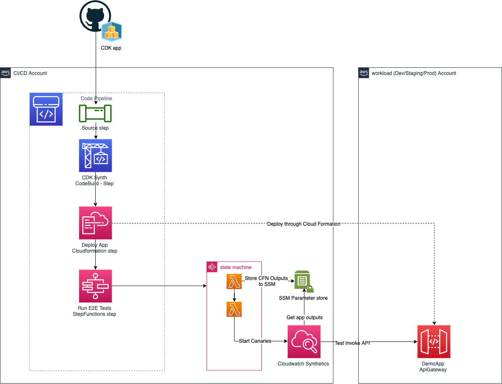
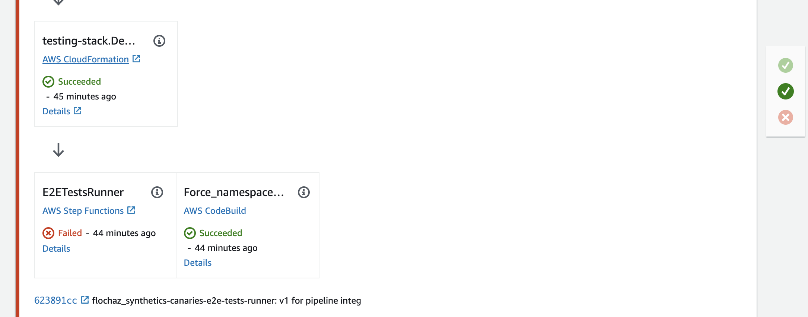
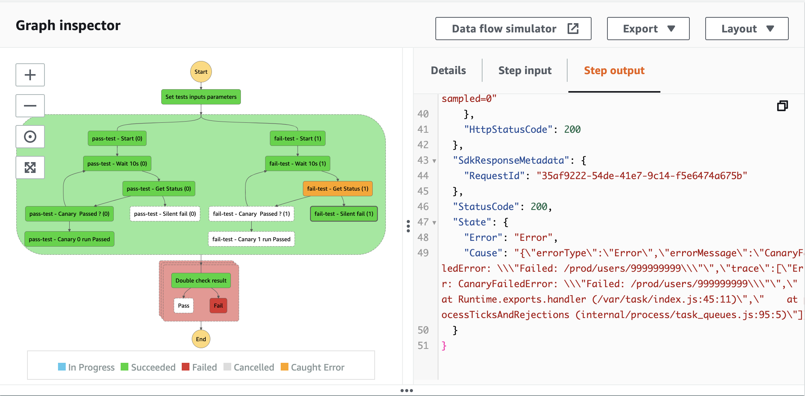

# CDK End to End (E2E) tests runner

> The APIs of higher level constructs in this module are experimental and under active development.
> They are subject to non-backward compatible changes or removal in any future version.

## Overview

This construct parallelise and check the results of end to end tests.

### Pipeline integration



## Usage

Check [API doc](./API.md) for more details.

### Integrate to CDK Pipelines

Assuming you have declared your pipeline in your CDK app using cdk pipelines:

```
class MyPipelineStack extends cdk.Stack {
  constructor(scope: cdk.Construct, id: string, props?: cdk.StackProps) {
    super(scope, id, props);

    const pipeline = new cdkpipeline.CodePipeline(this, 'Pipeline', {
      ...
    });
    ...
    const myApp = new MyApplication(this, 'Demo', {});
    const demoStage = pipeline.addStage(myApp);
    ...
```

then you can:

1. Add some Cloudwatch synthetics canary declaration in your pipeline stack constructor (`MyPipelineStack` in above example): 

    ```typescript
    const testAPI = new synthetics.Canary(this, 'Dummy Test', {
      canaryName: 'pass-test',
      schedule: synthetics.Schedule.once(),
      test: synthetics.Test.custom({
        code: synthetics.Code.fromInline('exports.handler = (event, context) => {console.log("hello")}'),
        handler: 'index.handler',
      }),
      runtime: synthetics.Runtime.SYNTHETICS_NODEJS_PUPPETEER_3_1,
    });
    ```

1. Then let's create a custom step using the e2e tests Step provided by this construct and pass the canaries to run as e2e test as well as potention cfnOutput that your synthetic canary test might need (the api url to test for instance).

    ```typescript
    const e2eTestsRunnerStep = new E2ETestsStep('E2ETestsRunner', {
      scope: this,
      canaries: [testAPI],
      inputsFromDeployedStack: [myApp.demoApiUrlCfnOutput],
    });
    ```

1. Add your step E2E step to your stage

   ```typescript
   demoStage.addPost(e2eTestsRunnerStep);
   ```

1. Add a ShellStep with the same outputs to workaround https://github.com/aws/aws-cdk/issues/16036

   ```typescript
    demoStage.addPost(new cdkpipeline.ShellStep('Force namespace setup', {
    envFromCfnOutputs: {
      URL: myApp.demoApiUrlCfnOutput,
    },
    commands: ['echo "CDK issue workaround"'],
   }));
   ```

1. Commit and deploy your pipeline

1. Check your pipeline for the e2e test step 


1. Check the step function execution



Check `src/integrationTests` for a full example.

### Integrate to your stack

TODO

## Additional Notes

* If one test fail other still run till ends.

## Roadmap

* Support stack auto rollback integration
* Support Other type of test runner (Synthetics canary only for now)
* Support Github Action integration

## Use Cases

Here are some examples of use cases for this construct:

* **Black box e2e testing and pipelines integration**
 * Add a step to run e2e tests after a stage deployment to block your pipeline
* **Stack e2e test to auto rollback**
 * This "resource" can be integrated directly in the main stack to make profite of auto rollback in case of failure.

## Inspiration

[AWS re:Invent 2020: Canaries in the code mines: Monitoring deployment pipelines](https://www.youtube.com/watch?v=IHbY897uEbQ)

## License

This project is licensed under the Apache-2.0 License.
